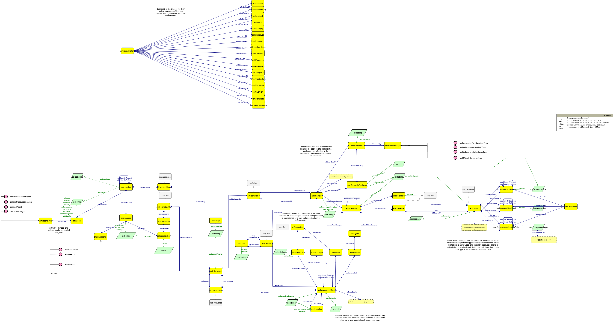
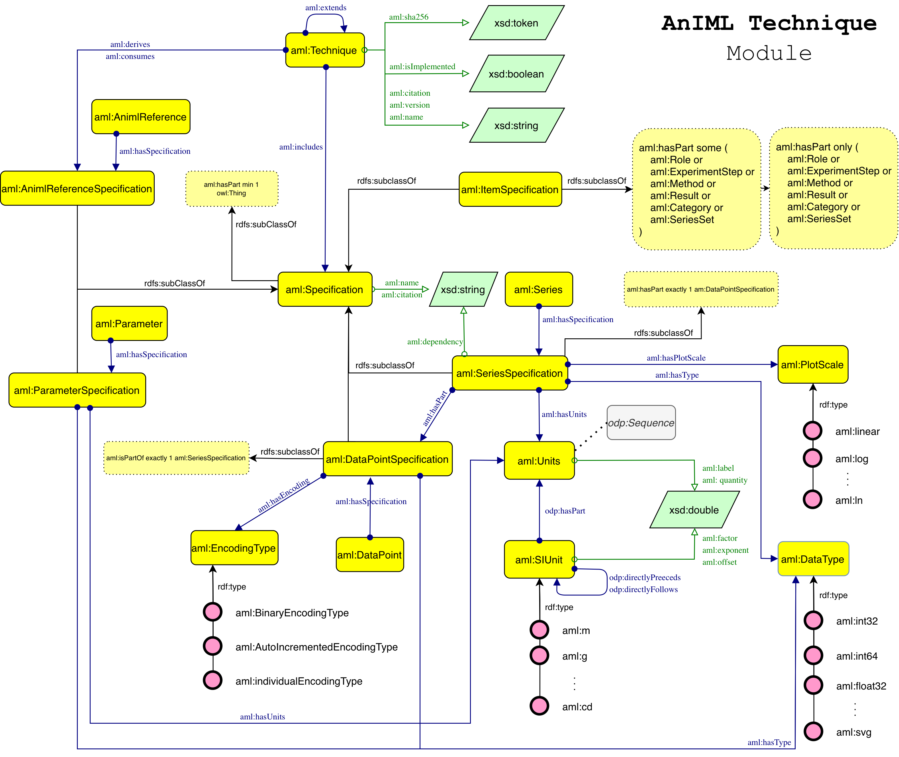

# The AnIML Ontology

**Enabling Semantic Interoperability for Large-Scale Experimental Data in Interconnected Scientific Labs**

<!-- [](https://zenodo.org/badge/latestdoi/animl-ontology) -->
[](https://creativecommons.org/licenses/by/4.0/)
[](https://semver.org/)
[]()

> 🔗 **Ontology URI:** [http://www.w3.org/animl/ontology/](http://www.w3.org/animl/ontology/)

## Overview

The **AnIML Ontology** is a comprehensive OWL 2 model that formalises the semantics of the **Analytical Information Markup Language (AnIML)** [1, 2]. While AnIML serves as a flexible XML-based standard for analytical chemistry and biology, achieving semantic interoperability across heterogeneous experimental systems remains a major barrier to data-driven discovery.

This ontology addresses that barrier by providing a formal semantic layer over the AnIML schema, enabling the management and exchange of experimental data with shared semantic interpretation across stakeholders. It is designed to support cross-system and cross-lab interoperability, bridging the gap between legacy XML data and the Semantic Web, and aligning with the **Allotrope Data Format** [3].

The ontology enables large-scale knowledge integration, automated reasoning for autonomous laboratories [5], and improved reproducibility in the R&D lifecycle, adhering to FAIR principles [6].

## Repository Structure

This repository is organized as follows:

- **`ontologies/`** - Contains the core ontology files:
  - `animl_ontology.owl` - Main OWL 2 ontology file
  - `animl_reference_pattern.shacl` - SHACL shapes for validating the Reference Pattern

- **`requirements/`** - Ontology requirements as competency questions (CQs) extracted via IDEA2 (expert-in-the-loop requirement eliciation) with Unilever.

- **`testing/`** - SPARQL query validation suite:
  - `1.rq` to `102.rq` - Individual SPARQL queries corresponding to each competency question.

- **`diagram/`** - Visual documentation:
  - `animl_core.png` - Graffoo diagram of the Core module
  - `animl_technique.png` - Graffoo diagram of the Technique module
  - `animl_pattern.png` - Graffoo diagram of the Reference Pattern

- **`examples/`** - Sample knowledge graphs from AnIML files provided by the industry partner,  demonstrating the ontology in use.

- **`alignments/`** - Ontology alignments to the Allotrope Data Format, released in SSSOM format [4]

## Methodology

The ontology was developed using a novel **expert-in-the-loop** methodology that combines the generative capabilities of Large Language Models (LLMs) with rigorous human oversight. We employed an iterative requirement elicitation workflow where LLMs extracted Competency Questions (CQs) directly from the AnIML Core and Technique schemas, which were then validated and refined by domain experts to filter hallucinations and ensure domain relevance.

The design phase followed **eXtreme Design (XD)** principles and collaborative whiteboarding using Graffoo to map these requirements into modular ontology structures. This process ensured the model prioritises the reuse of established Ontology Design Patterns (ODPs) while maintaining strict compatibility with the AnIML standard.

## Key Modules

The ontology is organised into primary modules that mirror the architectural separation of the original AnIML schema: the Core module, the Technique module, and a specific design pattern for handling references.

### The AnIML Core Module

The Core module formalises the AnIML Core Schema, representing the primary structure for experimental data, metadata, and provenance. The root of this module is the `aml:Document` class, which aggregates four main components: `aml:Experiment` for the data, `aml:SampleSet` for materials, `aml:AuditTrail` for versioning, and `aml:SignatureSet` for validation.



Sample management utilises the Set ODP, where `aml:SampleSet` contains individual `aml:Sample` objects. To capture the complex physical arrangements common in labs (e.g., multi-well plates), we model hierarchical relationships via the `aml:SampleInContainer` class. Experimental execution is modelled as an ordered sequence of `aml:ExperimentStep` objects, each linking a Method, the Infrastructure used, and the resulting Data.

### The Technique Module

While the Core provides the structure, the Technique module enforces domain-specific constraints, mapping the concept of AnIML Technique Definition Documents (ATDDs) to the `aml:Technique` class.



A Technique acts as a semantic blueprint. It comprises subclasses of `aml:Specification` that define the expected shape and data types of experimental entities. For instance, `aml:SeriesSpecification` constrains the units (e.g., Hz, nm) and visualisation properties (via `aml:PlotScale`) of a data series, ensuring correct interpretation of spectra or chromatograms.

### The AnIML Reference Pattern

A significant challenge in the AnIML XML schema is the use of implicit ID/IDREF mechanisms to link data, which are opaque to standard reasoners. We address this with the **AnIML Reference Pattern**.


We reify these pointers into the `aml:AnimlReference` class, which explicitly models the relationship using the `aml:pointsTo` property. This pattern allows us to capture the context of the reference, such as the specific role (e.g., "reference blank") and the scope of the data. Properties like `aml:startValue` and `aml:endValue` allow the ontology to reference specific subsets or slices of a data series, facilitating granular data access.

## Competency Questions

The ontology covers 102 validated Competency Questions (CQs) extracted from the standard. The complete list is available in `CQs/cqs.txt`, with corresponding SPARQL queries in the `testing/` directory. Below is a selection of questions the ontology is designed to answer:

**Experiment & Provenance**
* What is the unique ID of an experiment step?
* Which other experiment steps' data were used as input for the current step?
* What technique was applied in an experiment step?
* Who digitally signed a specific part of the document?
* When was a specific change made in the audit trail?

**Data & Samples**
* What are the individual 32-bit integer values in a series?
* What is the start index for a specific value set in a series?
* What is the sample ID of the container in which a sample is located?
* Is a specific sample derived from another sample?

**Technique Definitions**
* What is the required data type for a series in a technique definition?
* What units are allowed for a specific quantity in a technique definition?
* What is the recommended plot scale for a series?
* Is a series intended to be visible by default in a plot?

## Usage Examples

### SPARQL Query: Data Slicing
This query demonstrates how to retrieve the start index of a specific value set in a series using the Reference Pattern (CQ-96).

```sparql
PREFIX aml: <http://www.w3.org/animl/ontology/>

SELECT ?startIndex
WHERE {
    ?reference a aml:AnimlReference ;
               aml:pointsTo ?series ;
               aml:startValue ?startIndex .
    ?series a aml:Series .
}
```


## SHACL Validation
We employ SHACL shapes to enforce complex structural constraints (see `ontologies/animl_reference_pattern.shacl`). The following fragment ensures that the subject of a reference set aligns with the targets of the contained references.

```shacl
aml:SampleSetConfiguration
    a sh:NodeShape ;
    sh:property [
        sh:path aml:subject ;
        sh:class aml:SampleSet ;
        sh:minCount 1 ;
    ] ;
    sh:property [
        sh:path aml:hasMember ;
        sh:node [
            a sh:NodeShape ;
            sh:property [
                sh:path aml:pointsTo ;
                sh:class aml:Sample ;
            ]
        ]
    ] .
```

## Versioning

We adhere to the **Semantic Versioning (SemVer) format (X.Y.Z)**:
* **X (Major):** Denotes significant model changes or new requirements.
* **Y (Minor):** Denotes backward-compatible additions.
* **Z (Patch):** Denotes bug fixes or metadata updates.


## Contributing

We welcome contributions from the community to improve and extend the AnIML Ontology. If you identify bugs or inconsistencies, please open an Issue on this repository. To propose extensions, please open a Feature Request that includes a clear use case definition and the associated Competency Questions (CQs) that the new feature should satisfy. You are encouraged to fork this repository and open Pull Requests (PRs) for adding new functionalities -the team will review PRs against the core design patterns and existing constraints to ensure consistency with the ontology's architecture.

## Citation
If you use the AnIML Ontology in your work, please cite the following paper:

```bibtex
@article{morlidge2025animowl,
  title={The AnIML Ontology: Enabling Semantic Interoperability for Large-Scale Experimental Data in Interconnected Scientific Labs},
  author={Morlidge, Wilf and Watkiss-Leek, Elliott and Hannah, George and Rostron, Harry and Ng, Andrew and Johnson, Ewan and Mitchell, Andrew and Payne, Terry R. and Tamma, Valentina and de Berardinis, Jacopo},
  journal={Under Review},
  year={2025},
}
```

## References

[1] Schäfer, B. A., Poetz, D., & Kramer, G. W. (2004). Documenting laboratory workflows using the analytical information markup language. JALA: Journal of the Association for Laboratory Automation, 9(6), 375-381.

[2] Schäfer, B. (2025). Current AnIML Schemas. https://www.animl.org/current-schema

[3] Gardiner, S., Haynie, C., & Della Corte, D. (2024). Rise of the Allotrope simple model: Update from 2023 fall Allotrope connect. Drug Discovery Today, 29(4), 103944.

[4] Matentzoglu, N., et al. (2022). A simple standard for sharing ontological mappings (SSSOM). Database, 2022, baac035.

[5] Jiaru Bai, Sebastian Mosbach, Connor J Taylor, Dogancan Karan, Kok Foong
Lee, Simon D Rihm, Jethro Akroyd, Alexei A Lapkin, and Markus Kraft. A
dynamic knowledge graph approach to distributed self-driving laboratories. Nature
Communications, 15(1):462, 2024.

[6] Wilkinson, M. D., et al. (2016). The FAIR guiding principles for scientific data management and stewardship. *Scientific Data*, 3(1), 1-9.